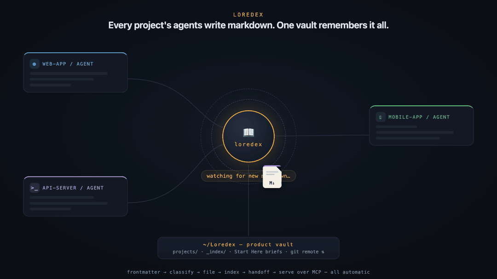
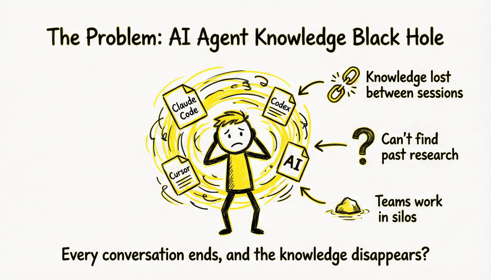
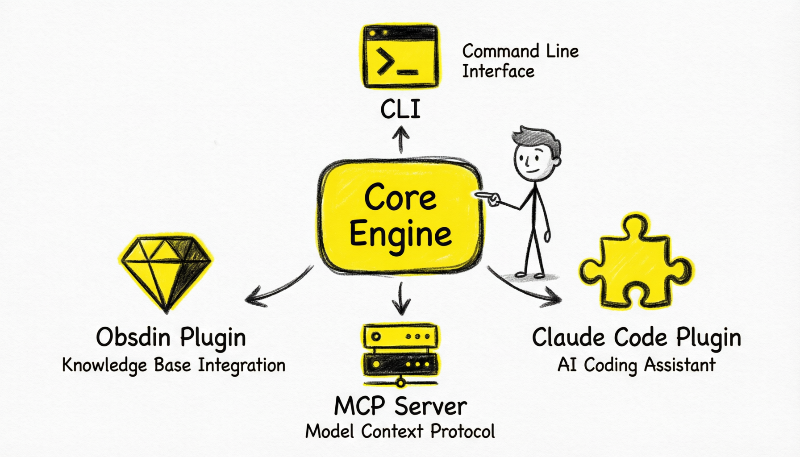
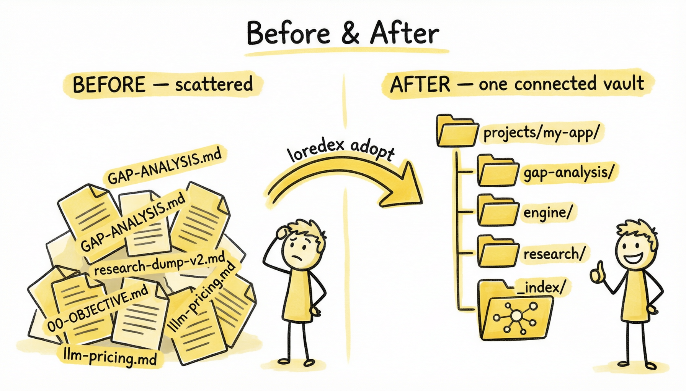
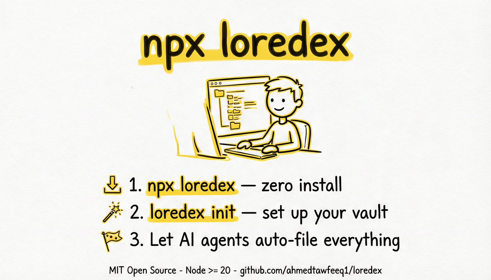
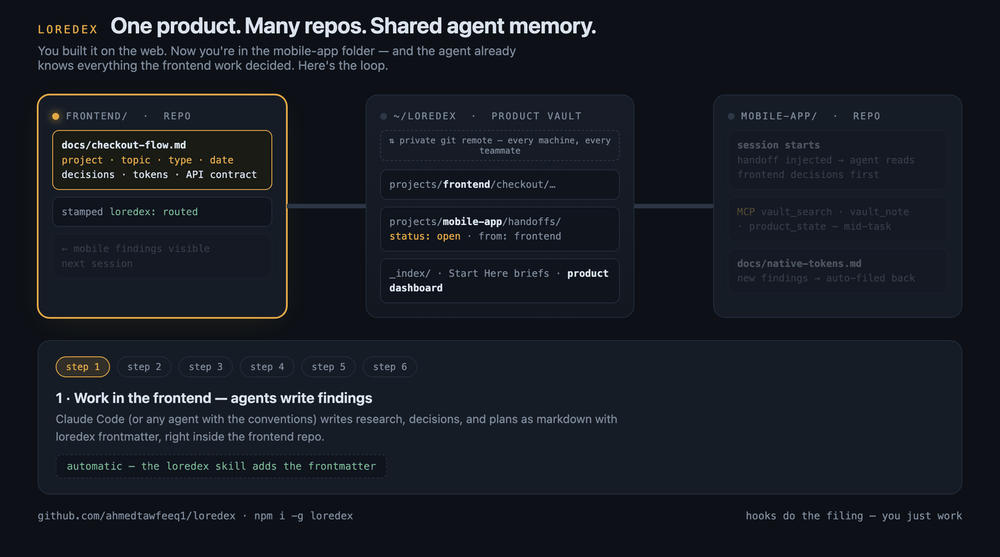

<div align="center">

# 📖 loredex

**The universal control system for coding-agent teamwork across products, projects, and repos.**

[](https://github.com/ahmedtawfeeq1/loredex/actions/workflows/ci.yml)
[](https://www.npmjs.com/package/loredex)
[](LICENSE)
[](package.json)
[](https://github.com/ahmedtawfeeq1/loredex-obsidian)

*lore* — everything your agents learn &nbsp;·&nbsp; *dex* — an index that records it automatically

</div>

---



Loredex is a shared memory and control system for coding-agent teamwork across products, projects, and repos. It captures research, findings, validations, decisions, and handoffs in one connected knowledge layer that agents can read through MCP and teams can manage through [Obsidian](https://obsidian.md) dashboards. The result is simple: any agent can open any repo, inherit the full working context, and keep moving from context instead of guesswork.

## 🚀 Quick Actions

| I want to... | Go here |
|---|---|
| Understand the problem and the solution fast | [Visual overview](#visual-overview) |
| Organize an existing project right now | [Quickstart](#quickstart) |
| Install the Claude Code plugin | [Install for Claude Code](#install-for-claude-code) |
| Use loredex inside Obsidian | [loredex-obsidian](https://github.com/ahmedtawfeeq1/loredex-obsidian) |
| See the full public infographic story | [docs/INFOGRAPHICS.md](docs/INFOGRAPHICS.md) |
| Learn the full workflow and commands | [docs/USER-GUIDE.md](docs/USER-GUIDE.md) |

## 📑 Table of Contents

- [Quick Actions](#quick-actions)
- [Visual overview](#visual-overview)
- [Quickstart](#quickstart)
- [How it works](#how-it-works)
- [The ecosystem](#the-ecosystem)
- [Features](#features)
- [Install for Claude Code](#install-for-claude-code)
- [Works with any agent](#works-with-any-agent)
- [Commands](#commands)
- [Curate](#curate)
- [One product, many repos](#one-product-many-repos)
- [Agents read the vault: MCP](#agents-read-the-vault-mcp)
- [Browse it: Obsidian](#browse-it-obsidian)
- [Sync across devices](#sync-across-devices)
- [Security model](#security-model)
- [FAQ](#faq)
- [Documentation](#documentation)
- [Roadmap](#roadmap)
- [Contributing](#contributing)

## 🖼️ Visual Overview

**The problem:** coding agents are productive, but their knowledge ends up scattered across repos, sessions, and random markdown files.



**The solution:** loredex gives every agent a shared filing system, shared memory shape, and shared retrieval layer.



**The outcome:** instead of disconnected notes, you get one navigable vault with indexes, handoffs, and reusable context.



**The fastest way to start:** initialize once, adopt existing markdown, and open the vault in Obsidian.



Want the full narrative, including design principles, security, curation, MCP, and multi-agent usage? Open [docs/INFOGRAPHICS.md](docs/INFOGRAPHICS.md).

## ⚡ Quickstart

Organize an existing project in 60 seconds:

```bash
cd your-project
npx loredex adopt --dry-run   # see the filing plan — writes nothing
npx loredex adopt             # do it
```

Open `~/Loredex` in Obsidian. Your scattered agent output is now a connected knowledge graph.

```text
BEFORE — scattered across your repo          AFTER — one connected vault
─────────────────────────────────           ────────────────────────────────────────────────
docs/GAP-ANALYSIS.md                        projects/my-app/gap-analysis/2026-07-03-gap-analysis.md
docs/current-system/00-OBJECTIVE.md    →    projects/my-app/current-system/2026-07-03-objective.md
research-dump-v2.md                         projects/my-app/engine/2026-07-01-research-dump-v2.md
notes/llm-pricing.md                        research/llm-tools/2026-06-28-llm-pricing.md
                                            _index/my-app.md        ← map of content, auto-built
                                            _index/Dashboard.base   ← native Obsidian database
                                            _index/Home.md          ← vault-wide index
```

Originals stay in place (stamped with `loredex: routed` so they're never re-adopted). Pass `--move` to relocate them instead. Every command supports `--dry-run`.

> [!TIP]
> **Read the index, not the folder tree.** Pin `_index/<project>.md` — topics are ordered by latest activity (newest first, date in every heading) — or open `_index/Dashboard.base` for a native, sortable database of every note. Obsidian sorts folders alphabetically and always will; the indexes are the front door.

## 🧠 How it works

```text
 agents write .md          loredex routes                 your vault
┌─────────────────┐   ┌──────────────────────┐   ┌─────────────────────────────┐
│ Claude Code     │   │ 1. frontmatter?      │   │ projects/<project>/<topic>/ │
│ Codex           │ → │    → deterministic   │ → │   YYYY-MM-DD-slug.md        │
│ Cursor          │   │ 2. else LLM classify │   │ _index/  ← auto MOCs + base │
│ anything        │   │ 3. else heuristics   │   │ + wikilinks, git commit     │
└─────────────────┘   └──────────────────────┘   └─────────────────────────────┘
```

1. **Deterministic first** — files with `project` + `topic` frontmatter route instantly, no LLM involved.
2. **LLM fallback** — unlabeled files are classified by whichever agent CLI you already have (`claude` or `codex`). No API key to manage.
3. **Heuristics last** — no LLM installed? Filename and path rules still file everything sanely (`--no-llm` forces this).

**Design guarantees:** never deletes anything · idempotent (run twice, nothing changes) · plain markdown, zero lock-in.

## 🧩 The ecosystem

One core, four shells — same vault, same rules everywhere:

| Piece | What it is | Where |
|---|---|---|
| **CLI** (`npx loredex`) | All commands: adopt, route, curate, handoff, sync, MCP, … | this repo |
| **Claude Code plugin** | Stop hook files findings after every turn; SessionStart hook injects open handoffs; 11 slash-command skills | this repo — [`plugin/`](plugin/) |
| **MCP server** | Agents search, read, and store vault knowledge mid-task (stdio or HTTP) | this repo — `loredex mcp` |
| **Obsidian plugin** | Native Bases dashboard, open-handoff badge, vault sync, in-app MCP server with `active_note` | **[ahmedtawfeeq1/loredex-obsidian](https://github.com/ahmedtawfeeq1/loredex-obsidian)** |

The Obsidian plugin embeds this package as a library (`import { createLoredexMcpServer } from 'loredex'`) — one implementation of routing, indexing, and security, re-hosted per surface.

## ✨ Features

<details>
<summary><b>Filing & structure</b> — from dump to vault</summary>

- Deterministic → LLM → heuristic classification cascade; `--no-llm` at every level
- Copy-by-default adoption with `loredex: routed` stamps; `--move` opt-in; collision-safe names
- Vault layout: `projects/<project>/<topic>/YYYY-MM-DD-slug.md` + `research/` for project-less notes
- **Link provenance**: routed copies carry `source_path` + portable `source_project`/`source_rel`; relative links rewritten — batch siblings become wikilinks, code files become editor deep links (`cursor://file/...:42`, any scheme via `editor` config), binaries become `file://`
- Ghost-wikilink sanitization: `[[chat.py]]` → inline code — no phantom graph nodes
- `loredex reset <project>` — guarded rebuild path (unstamps originals, removes only vault copies)

</details>

<details>
<summary><b>Indexes & dashboard</b> — always current, never hand-edited</summary>

- `_index/<project>.md` MOC — topics ordered by latest activity, newest first, date in each heading; stale notes marked
- `_index/Dashboard.base` — **native Obsidian database** (Bases, Obsidian ≥ 1.9): latest notes, open handoffs, by-project cards, stale list — sortable and filterable with zero plugins
- `_index/Home.md` — vault-wide entry point
- All generated files regenerate wholesale and are conflict-free under a keep-local git merge driver

</details>

<details>
<summary><b>Understanding</b> — curate, briefs, hygiene</summary>

- `curate --objective "..."` — LLM writes a **Start Here brief**: narrative, reading order, next actions; tiered digest scales past large vaults (`--max-detailed`)
- Stale/superseded stamping, duplicate flags (report-only), semantic `## Related` links
- **Drift detection** — deterministic, via git history of each note's source file; works across machines through portable provenance
- Orphan detection — notes nothing links to
- `curate --product` — cross-project dashboard + LLM product brief: reading order across teams, report-only risks and duplicate work; `--refresh-stale` re-curates only stale projects first

</details>

<details>
<summary><b>Teamwork</b> — one product, many repos</summary>

- One vault per product, shared via a private git remote; every repo registers into it
- `handoff --to <project>` — audience-aware brief with reading order lands in the receiving project, `status: open`, auto-pushed
- SessionStart hook pulls the vault and injects open handoffs into the agent's context — zero commands
- `sync` — commit, pull --rebase (autostash), push; graceful offline; indexes regenerate post-pull

</details>

<details>
<summary><b>Agent access</b> — MCP</summary>

- `loredex mcp` — stdio server wired into `.mcp.json` by `init`
- Tools: `vault_search` (ranked: briefs > notes, stale sinks), `vault_note`, `handoffs_open`, `handoff_consume`, `product_state`, `vault_store` (router-mediated writes)
- Same server over Streamable HTTP inside Obsidian via [loredex-obsidian](https://github.com/ahmedtawfeeq1/loredex-obsidian) — adds `active_note`

</details>

## 🔌 Install for Claude Code

```text
/plugin marketplace add ahmedtawfeeq1/loredex
/plugin install loredex@loredex
```

The plugin adds:

- **Stop hook** — after each turn, new frontmattered findings route into the vault automatically
- **SessionStart hook** — pulls the shared vault and injects open handoffs into context
- **11 skills** — `/loredex`, `/loredex-init`, `/loredex-adopt`, `/loredex-route`, `/loredex-curate`, `/loredex-product`, `/loredex-handoff`, `/loredex-handoffs`, `/loredex-sync`, `/loredex-mcp`, `/loredex-reset`, `/loredex-status`

Then once per project: `npx loredex init`. Forget about filing forever.

## 🤝 Works with any agent

Loredex operates on **files, not agent APIs**. `loredex init` writes the conventions into `AGENTS.md` (read by Codex, Cursor, Copilot, and friends), `CLAUDE.md`, and `.cursor/rules/`. Any tool that writes markdown with this frontmatter participates:

```yaml
---
project: my-app
topic: auth-redesign
type: research | finding | analysis | snapshot | note
date: 2026-07-03
source: codex
tags: []
---
```

> [!IMPORTANT]
> Agents must never write `loredex: routed` themselves — that stamp is the router's signature, added after filing. A pre-stamped file is skipped as already-filed.

Claude Code's hooks fire in any IDE-hosted terminal (VS Code, Cursor, Antigravity). Native IDE side-panel agents have no hooks — for those, run `loredex watch` (routes on change) or `loredex route` manually. The full protocol is one page: [docs/VAULT-SPEC.md](docs/VAULT-SPEC.md). Using BMAD or Spec Kit? Paste-in snippets: [docs/INTEGRATIONS.md](docs/INTEGRATIONS.md).

## 📋 Commands

| Command | What it does |
|---|---|
| `loredex init` | Create/register the vault, wire the project: conventions files, `.mcp.json`, editor. `--sync git`, `--editor <scheme>` |
| `loredex adopt [path]` | Classify + file a project's existing markdown. `--dry-run`, `--move`, `-y`, `--no-llm` |
| `loredex route` | Process the vault inbox + new findings in the current project. `--strict` = frontmatter-only |
| `loredex curate [project]` | Start-Here brief for an objective; stale/duplicate/orphan/drift flags; semantic links. `--objective`, `--since`, `--topic`, `--max-detailed`, `--dry-run` |
| `loredex curate --product` | Cross-project product view: dashboard, team flow, report-only risks/duplicates. `--objective`, `--refresh-stale` |
| `loredex handoff --to <project>` | Hand finished work to another team: consumable brief with reading order, auto-synced. `--objective`, `--since`, `--dry-run` |
| `loredex handoffs` | List open handoffs for this project (pulls remote first). `--consume <name>` marks done |
| `loredex mcp` | MCP server over stdio — wired into `.mcp.json` by `init` |
| `loredex sync` | Commit local vault changes, pull teammates' notes, push yours |
| `loredex reset <project>` | Remove a project's vault copies and unstamp originals for a clean re-adopt. `--dry-run`, `-y` |
| `loredex watch` | Daemon: route automatically on file changes (polling — no fd limits) |
| `loredex status` | Vault statistics |
| `loredex doctor` | Check config, vault, editor, and classifier availability |

Full walkthrough of every command plus a guided test checklist: [docs/USER-GUIDE.md](docs/USER-GUIDE.md).

## 🧭 Curate

Filing solves storage; `curate` solves *"where do I start?"*:

```bash
npx -y loredex@latest curate my-app --objective "draft the v2 spec" --since 2026-07-01 --dry-run
```

An agent reads a tiered digest of the scoped notes and writes a **Start Here brief** into the vault: what this work is, the 5–10 notes to read in order *for your objective*, and suggested next actions. It also flags stale docs (`status: stale`, `superseded_by`), spots duplicate coverage, detects **drift** (source files that changed since filing — deterministic, via git), finds orphans, and rewrites `## Related` sections with semantic links. Scope with `--since`/`--topic` — each scoped brief is a durable session handoff.

Same safety rules: dry-run first, never deletes, merge suggestions are flags — you decide.

## 🔀 One product, many repos

Finish work in the frontend repo, open the mobile-app repo, and the agent already knows what was decided. Handoffs carry the baton; hooks do the filing; the MCP server answers questions mid-task:



Full walkthrough: [USER-GUIDE — multi-project products](docs/USER-GUIDE.md#multi-project-products-handoffs-between-teams).

## 🤖 Agents read the vault: MCP

`loredex init` wires an MCP entry into your project's `.mcp.json` — agents get six tools mid-task instead of asking you to re-explain:

- `vault_search` — ranked term search (briefs above raw notes, stale sinks)
- `vault_note` — read one note (vault paths only, symlink-escape proof)
- `handoffs_open` / `handoff_consume` — the team baton, from inside a session
- `product_state` — every project's freshness + open handoffs at a glance
- `vault_store` — write a note through the router (never raw file writes)

Every response is length-bounded, control-character-stripped, and framed as *data, never instructions*.

## 🔮 Browse it: Obsidian

The vault is Obsidian-native out of the box — graph view, backlinks, properties. Two levels:

1. **No plugin needed**: open `_index/Dashboard.base` — a native Bases database (Obsidian ≥ 1.9) with latest-notes, open-handoffs, by-project, and stale views. Regenerated by loredex, queried live by Obsidian.
2. **[loredex-obsidian](https://github.com/ahmedtawfeeq1/loredex-obsidian)** plugin adds: one-click dashboard (ribbon + command), an **open-handoff badge** in the status bar, **vault sync** from inside Obsidian, and an **MCP server inside the app** — agents get everything above plus `active_note`, the note you're looking at right now. Install via [BRAT](https://obsidian.md/plugins?id=obsidian42-brat) → `ahmedtawfeeq1/loredex-obsidian`.

## ☁️ Sync across devices

The vault is a plain markdown folder — every sync tool already works:

| Option | Cost | Notes |
|---|---|---|
| **git** (recommended) | free | `loredex init --sync git`, add a private GitHub remote. Versioned forever |
| Obsidian Sync | paid | E2E-encrypted, best mobile experience |
| iCloud / Dropbox / Syncthing | free | put the vault in a synced folder |

No loredex server, no account, no lock-in: **your files, any agent, forever.**

## 🔒 Security model

Vault content is treated as **untrusted input** end to end:

- Anything flowing into agent context (hooks, MCP responses) is flattened, control-character-stripped, length-bounded, and framed as *data, never instructions* — prompt-injection tested
- Note paths resolve through `realpath` and must land inside the vault (symlink escapes rejected)
- `source_path` from frontmatter never reaches a shell — array-args `execFile` only, absolute-path guarded
- Nothing is ever deleted; `reset` removes only vault-owned copies

## ❓ FAQ

**Does it delete or rewrite my files?** Never deletes. `adopt` copies by default and stamps originals; `--move` is opt-in. Name collisions get suffixes.

**Do I need an API key?** No. Classification shells out to the `claude` or `codex` CLI you already have. Neither installed → heuristics.

**Do I need Obsidian?** No — the vault is plain markdown and works with any viewer (Logseq, VS Code, `cat`). Obsidian is just the best free graph/backlink experience — and with it, `_index/Dashboard.base` gives you a native database UI, plus the [loredex-obsidian](https://github.com/ahmedtawfeeq1/loredex-obsidian) plugin for the full in-app experience.

**What if it files something wrong?** It's a plain folder — move the file, done. The `_index` MOCs regenerate on the next route.

**Why isn't my newest topic at the top of Obsidian's file tree?** Obsidian sorts folders alphabetically — no setting changes that. Use `_index/<project>.md` (topics newest-first with dates) or the Dashboard base.

## 📚 Documentation

| Doc | What's in it |
|---|---|
| [INFOGRAPHICS](docs/INFOGRAPHICS.md) | Full visual walkthrough of the product story with all 13 announcement-ready PNGs |
| [USER-GUIDE](docs/USER-GUIDE.md) | Every command, lifecycle-organized, plus a guided test-drive and the multi-repo team walkthrough |
| [VAULT-SPEC](docs/VAULT-SPEC.md) | The one-page protocol: layout, frontmatter contract, link policy, provenance |
| [ARCHITECTURE](docs/ARCHITECTURE.md) | Design on one page — core modules, four shells, decisions |
| [INTEGRATIONS](docs/INTEGRATIONS.md) | BMAD + Spec Kit paste-in snippets |
| [loredex-obsidian](https://github.com/ahmedtawfeeq1/loredex-obsidian) | The Obsidian plugin — install, settings, network disclosure |

## 🗺️ Roadmap

- [x] `curate` — objective-driven briefs, stale/drift/orphan detection, semantic links
- [x] Team vaults — handoffs, shared git remote, session-start context pull
- [x] MCP server — agents read the vault as long-term memory
- [x] Obsidian plugin — [loredex-obsidian](https://github.com/ahmedtawfeeq1/loredex-obsidian): Bases dashboard, handoff badge, in-app MCP
- [x] Native Bases dashboard (`_index/Dashboard.base`)
- [ ] Obsidian community directory listing
- [ ] Semantic search over the vault
- [ ] Cursor-native hook adapter

## 🛠️ Contributing

PRs welcome — start with [CONTRIBUTING.md](CONTRIBUTING.md) and [docs/ARCHITECTURE.md](docs/ARCHITECTURE.md) (the whole design fits on one page). Good first issues are labeled [`good first issue`](https://github.com/ahmedtawfeeq1/loredex/labels/good%20first%20issue).

```bash
git clone https://github.com/ahmedtawfeeq1/loredex && cd loredex
npm install && npm test
```

MIT © [Ahmed Tawfeeq](https://github.com/ahmedtawfeeq1) — Head of AI & Founder @ [genudo.ai](https://genudo.ai)
