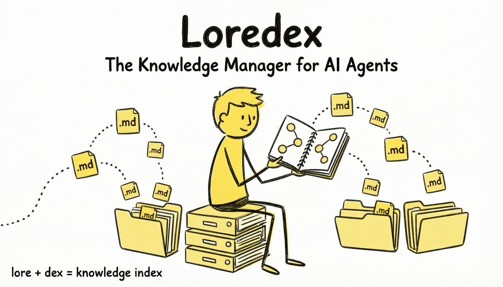
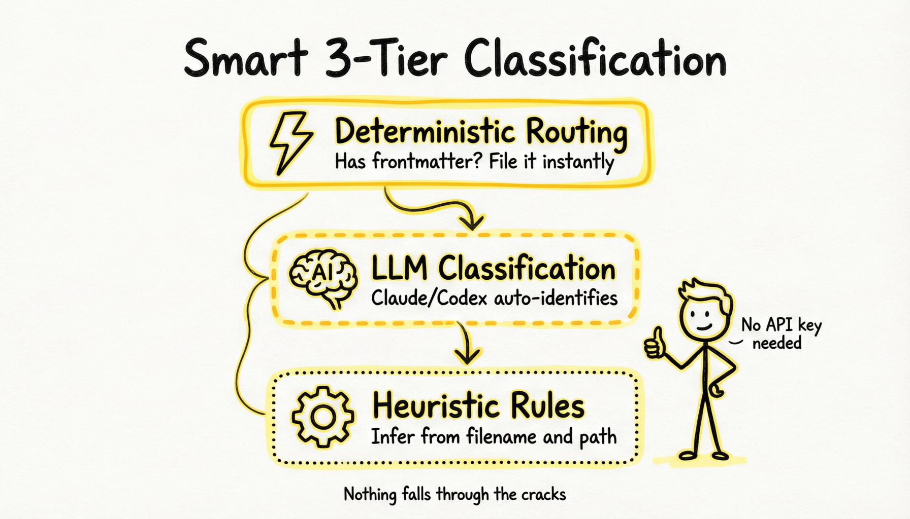
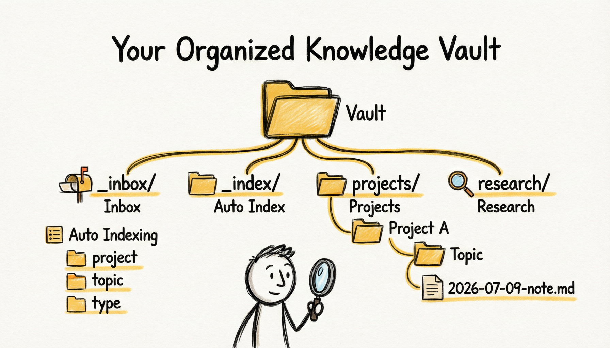
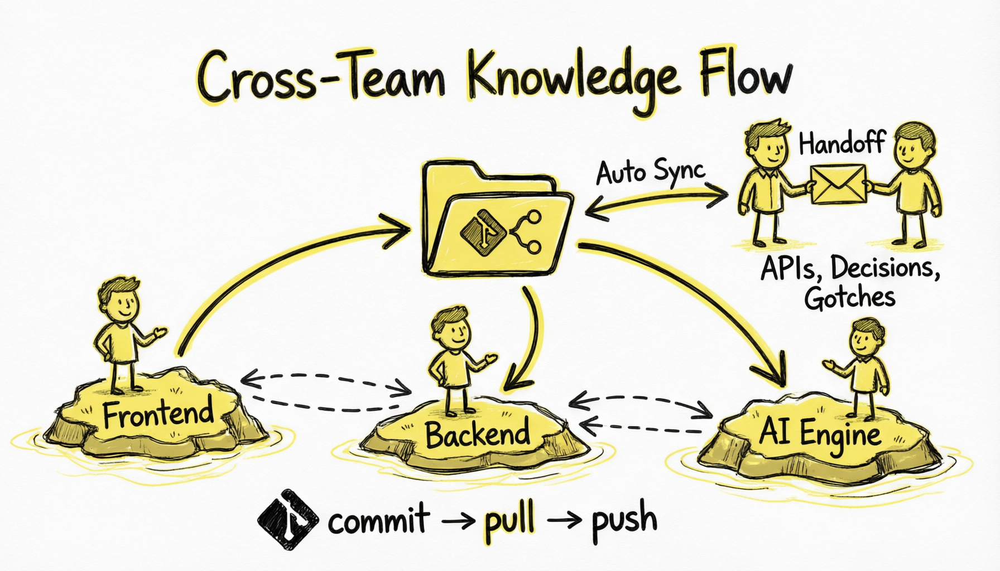
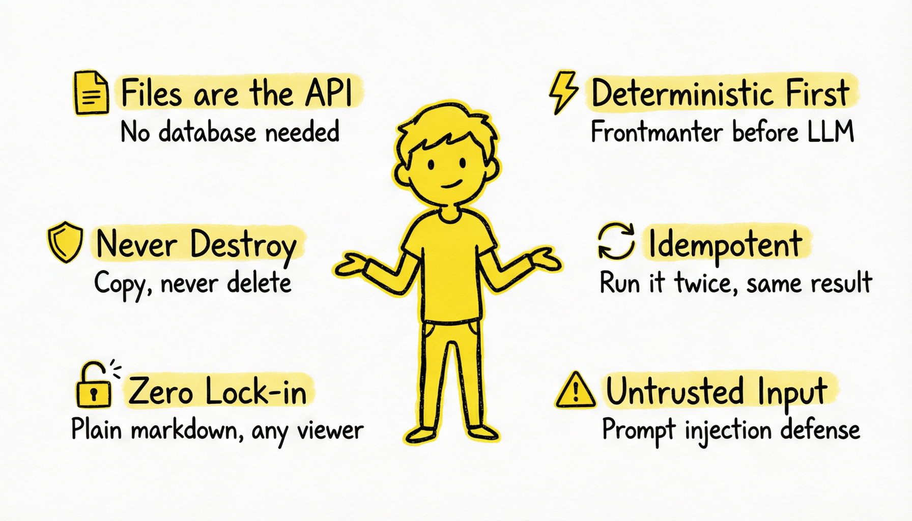
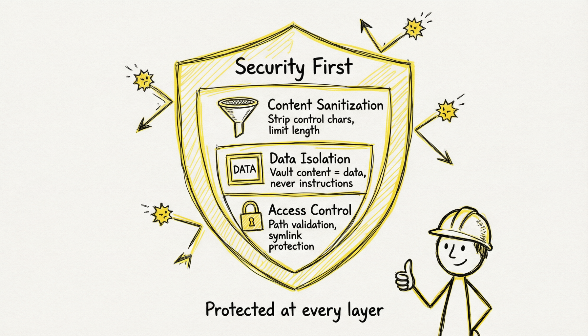
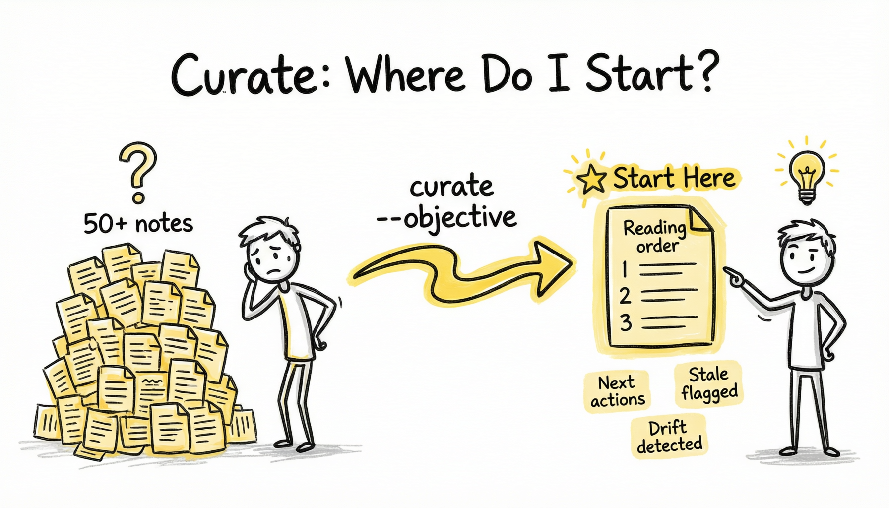
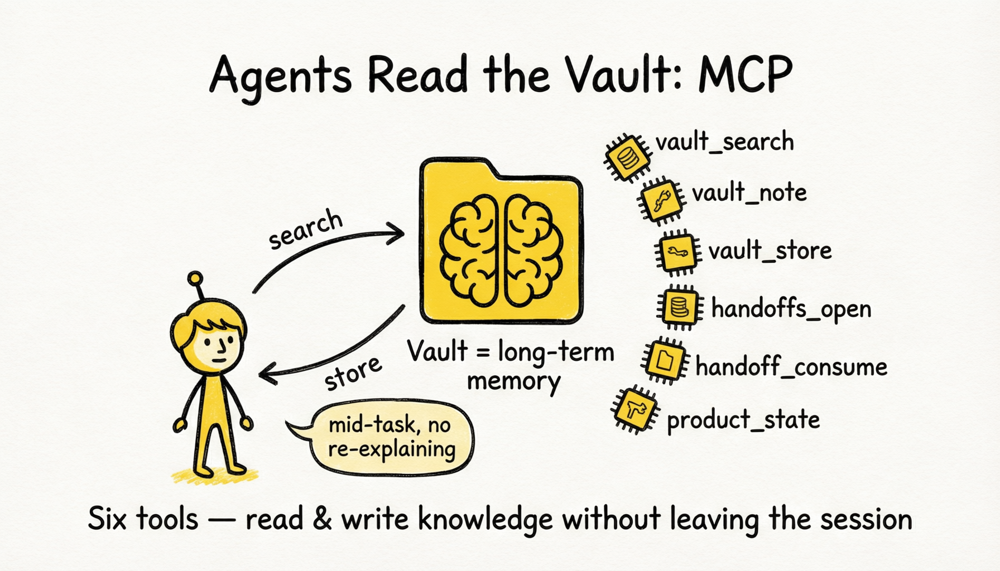
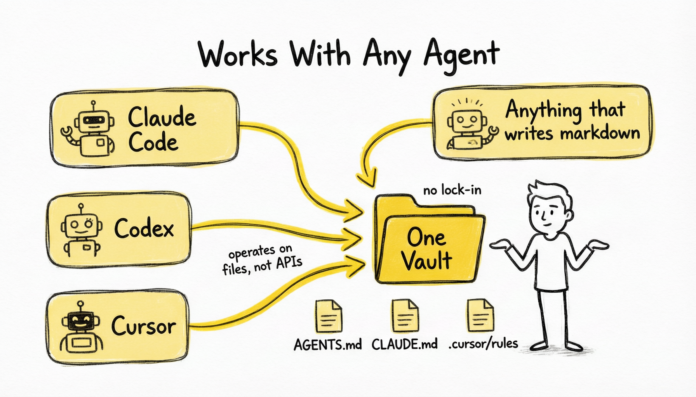

# Infographics

The full `loredex-infographics` set lives in [`docs/assets/`](assets/). Use this page as the
announcement-ready visual walkthrough of the product story.

## Full set

### 01. Cover

### 02. The problem

### 03. Architecture

### 04. Classification

### 05. Vault structure

### 06. Team collaboration

### 07. Design principles

### 08. Security

### 09. Get started

### 10. Before and after

### 11. Curate

### 12. MCP

### 13. Any agent

